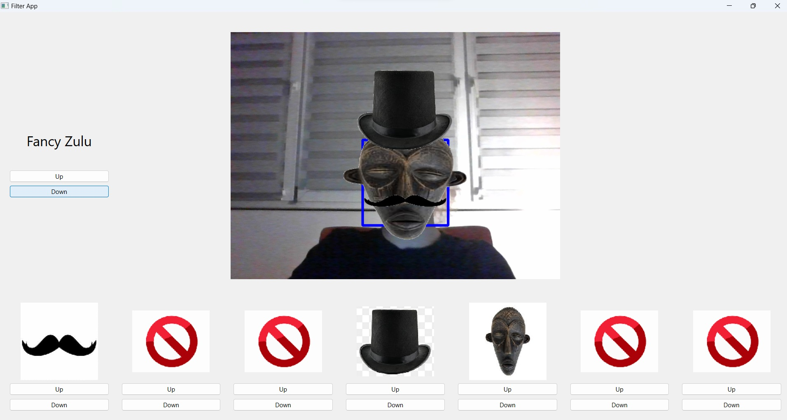

CP3 final project
The program is a C++ desktop app with device camera input that detects faces and hands
using Haar cascades and displays filters on them. Users can choose from various filters,
such as glasses, hats, gloves, etc. They can also select a predefined filter set to apply a
cohesive and aesthetically pleasing combination with a single click. The program utilises QT
for the graphical user interface and OpenCV for image processing. Filters are loaded from
the project directory: /media/img. To manage complexity, an object-oriented approach is
employed, implementing classes like BaseFilter, Carousel, and FilterSet. Inheritance
techniques and template typed classes with static_assert simulate interface behaviour.
Exception handling is implemented for stability.

